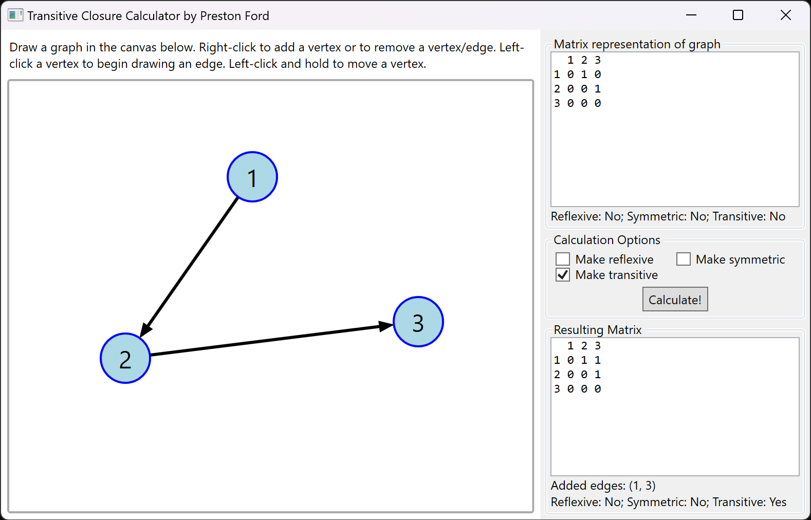
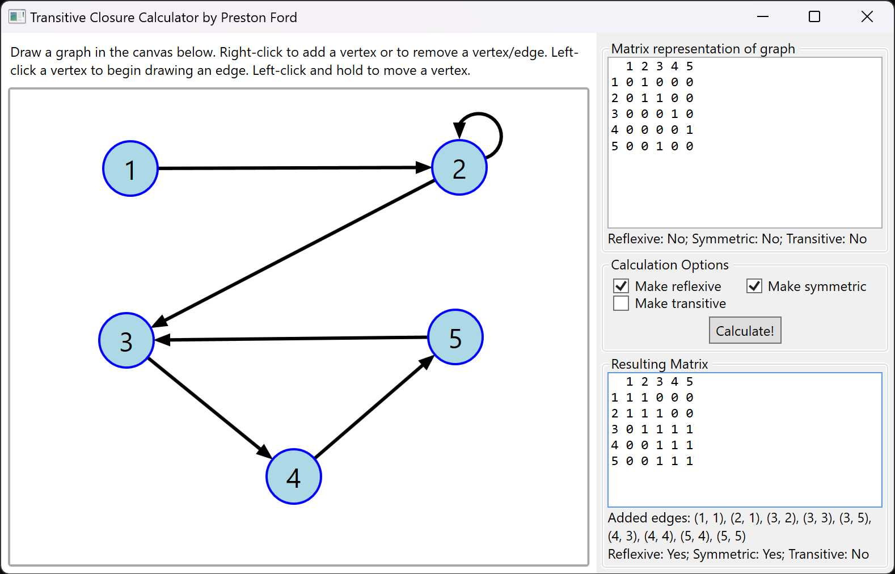

A Windows app written in C# using .NET 6 which serves as graph drawer/transitive closure calculator with a graphical user interface (WPF).

# Screenshots

# List of features
- Use the mouse to draw vertices/edges
- You can drag vertices to move them and their edges will follow
- Generates matrix representation of graph as it is modified
- Calculate reflexive, symmetric, and transitive closures
